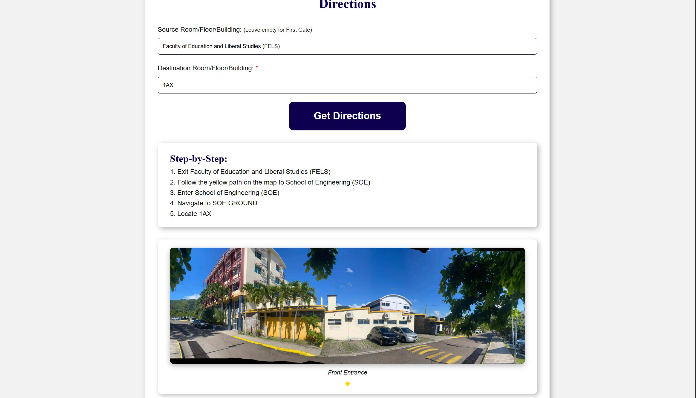
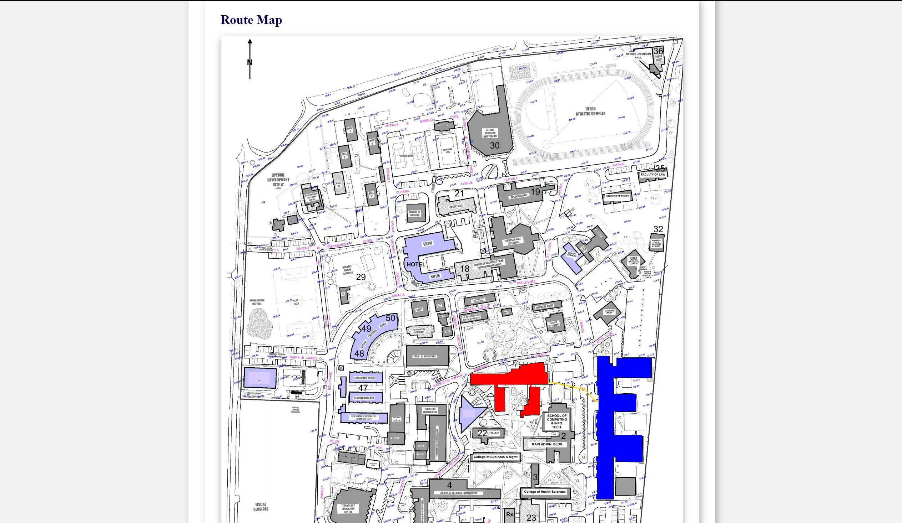

# UTech Papine Campus Directions System

A student innovation project that helps anyone find their way around the University of Technology, Jamaica's Papine Campus — no prior knowledge needed.

---

## Demo

### Home Page


### Step-by-Step Directions & Building Photo


### Route Map


---

## What It Does

This web app lets you type where you are and where you want to go. It then shows you:

- **Step-by-step text directions**
- **A map with your route drawn on it** — source building highlighted red, destination in blue, path in yellow
- **Photos of the destination building**

---

## How It Works — The Big Picture

The system is built in three layers that talk to each other:

### 1. Data Layer — *What the app knows*
- **`treeDataStruct.js`** — Stores every building and room in a tree structure. This is how the app understands "Room 1A37 is on the Ground Floor of SOE."
- **`graphDatabase.js`** — Stores every building and walkway as a node on a map graph. Connections between nodes represent actual paths you can walk.
- **`campusMapRenderer.js`** — Knows the exact pixel coordinates of every building outline on the campus map image.

### 2. Processing Layer — *What the app thinks*
- **`validateInput.js`** — Checks that what you typed actually exists before doing anything else.
- **`findRequiredNode.js`** — Figures out whether your input is a building or room.
- **`FindPath.js`** — Uses **Dijkstra's Algorithm** with a Min-Heap to find the shortest walking route between two buildings.
- **`suggestLocation.js`** — Powers the autocomplete dropdown using fuzzy search (Fuse.js). Suggests buildings and rooms only.
- **`getBuildingPictures.js`** — Looks up the right photos for the destination building.

### 3. Output Layer — *What you see*
- **`displayTextDirections.js`** — Writes out the step-by-step directions based on your source and destination.
- **`displayMapWithPath.js`** — Draws the route line and highlights your buildings on the campus map canvas.
- **`displayCarousel.js`** — Shows building photos with prev/next navigation.
- **`createOutputSection.js`** — Builds the results area in the HTML when you submit.

---

## Project Structure

```
project/
├── index.html                  # The single page
├── styles.css                  # All styling
├── app.js                      # Main controller — wires everything together
│
├── storage/
│   ├── treeDataStruct.js       # Building → Room tree
│   ├── graphDatabase.js        # Campus walkway graph
│   └── campusMapRenderer.js    # Map drawing logic
│
├── processing/
│   ├── validateInput.js
│   ├── findRequiredNode.js
│   ├── FindPath.js             # Dijkstra's shortest path
│   ├── suggestLocation.js      # Fuzzy autocomplete
│   ├── getBuildingPictures.js
│   └── createOutputSection.js
│
├── output/
│   ├── displayTextDirections.js
│   ├── displayMapWithPath.js
│   ├── displayCarousel.js
│   └── displayPicture.js
│
└── assets/
    ├── UTECH_MAP.webp          # The base campus map image
    └── buildings/              # Building photos
```

---

## Getting Started

No build tools needed. This is plain HTML, CSS, and ES Modules.

1. Clone or download the project
2. Serve it from a local web server (required for ES Modules to work)
   ```bash
   # Using Python
   python -m http.server 8000

   # Using Node.js
   npx serve .
   ```
3. Open `http://localhost:8000` in your browser

> **Note:** Opening `index.html` directly as a file (`file://`) will not work because browsers block ES Module imports from the local filesystem.

---

## How to Add Content

### Adding a New Building Photo
1. Add the image to `assets/buildings/<Building_Name>/`
2. Register it in `getBuildingPictures.js` under the matching building name key

### Adding a New Building to the Graph
1. Create a `GraphNode` in `graphDatabase.js`
2. Connect it to nearby walkway nodes using `addBidirectionalNeighbor()`
3. Add its pixel outline to `campusMapRenderer.js`
4. Add its rooms to `treeDataStruct.js`

---

## Key Design Decisions

| Decision | Why |
|---|---|
| Dijkstra's + Min-Heap | Fastest shortest path for a sparse campus graph |
| Tree for rooms | Natural fit — rooms live inside buildings |
| Graph for walkways | Allows any-to-any pathfinding across the campus |
| Canvas for map | Lets us draw paths and colour buildings on the image |
| ES Modules (no bundler) | Keeps the project simple with no build step needed |

---

## Current Version

**v3.0** — A UTech Student Innovation Project  
*"Thy word is a lamp unto my feet, and a light unto my path" — Psalm 119:105*
